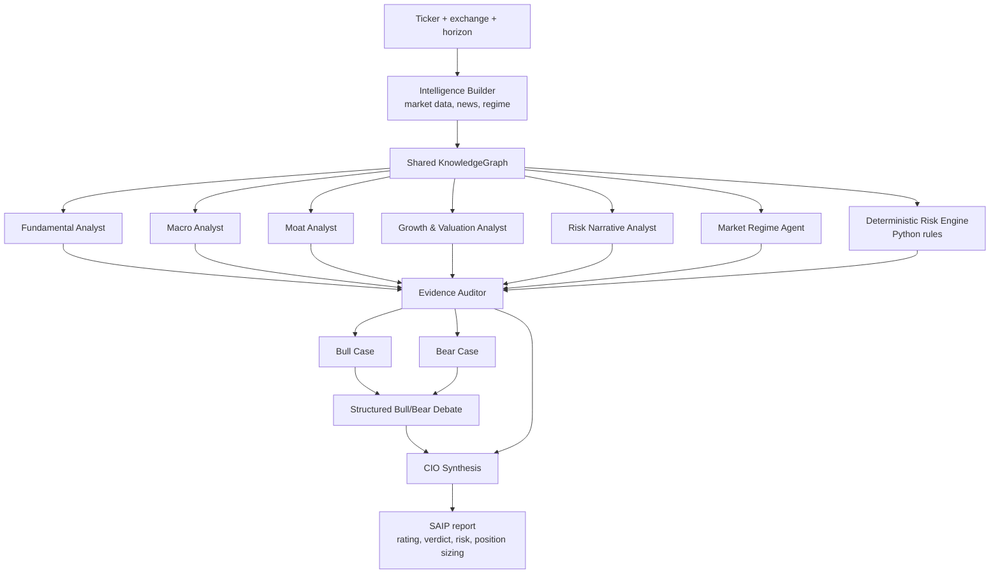
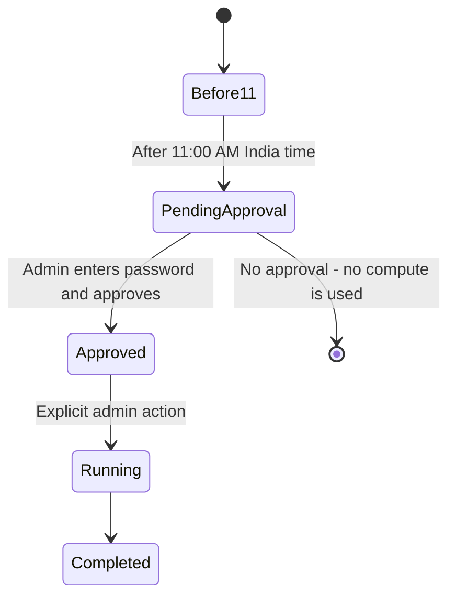

# SAIP — Stock Analysis Intelligence Platform

**SAIP** is a local-first, multi-agent equity-research workspace for single-stock analysis, public YouTube stock-signal screening, and private Telegram delivery. It combines deterministic market-data processing with specialised AI research agents, evidence checks, debate, and a final CIO-style investment view.

> Informational research only - not investment advice. Always verify market data and make independent decisions.

## Hackathon summary

SAIP turns a stock ticker or a public YouTube channel/video into a traceable research workflow. Instead of asking one model for a recommendation, it builds a shared market-intelligence record, asks specialist agents to analyse different dimensions, audits their evidence, runs a bull/bear debate, and produces a readable final report. Users can request reports privately through Telegram, while an admin retains visibility and control over the compute queue.

**Repository:** [github.com/kishan2805/Stock_analysis_Intelligence_platform](https://github.com/kishan2805/Stock_analysis_Intelligence_platform)

## What SAIP does

| Surface | Purpose |
|---|---|
| **SAIP Stock Analysis** | Deep analysis for one NSE or US ticker, with a downloadable PDF report. |
| **YouTube Stock Scanner** | Extracts explicit Indian-stock calls from public videos/channels, resolves tickers conservatively, scores them, and exports CSV/PDF results. |
| **Telegram Bot** | Lets users request a private stock or video analysis, select the correct market, receive the report, and manage channels. Recent reports are reused for seven days. |
| **SAIP Admin** | Password-protected approval page for compute-heavy, all-user channel runs, Telegram-worker status, live queue activity, and reject/restart controls. |

## How OpenAI Codex and GPT-5.6 were used

OpenAI Codex, powered by GPT-5.6, was used as the development collaborator for this project. It helped us inspect the existing architecture, implement and test the Telegram workflow, strengthen ticker/market disambiguation, add first-come-first-served analysis queuing and seven-day report reuse, improve PDF output, and make the Streamlit admin surface observable and controllable.

Codex was also used to document the design, review edge cases, and run the automated test suite after changes. The application does **not** present GPT-5.6 as a runtime investment model: SAIP's runtime model routing remains configurable in [`config/settings.yaml`](config/settings.yaml), and every investment output is clearly labelled as informational research rather than advice.

## Suggested screenshot captions

Use these captions when adding the project media to the hackathon submission.

| Screenshot | Caption |
|---|---|
| SAIP Stock Analysis screen | **Configure a deep-dive:** choose an NSE or US ticker, time horizon, analysis depth, and whether to run the bull/bear debate. |
| YouTube Stock Scanner screen | **Turn public videos into a research shortlist:** scan public videos or saved channels, extract explicit stock calls, and rank candidates for SAIP analysis. |
| SAIP Admin — Telegram worker | **Operate private delivery safely:** start or stop the Telegram worker and see queued, running, and completed private analyses. |
| SAIP Admin — channel library | **Keep compute under human control:** inspect saved user channels and require explicit daily approval before an all-user scan runs. |

## Agent orchestration



The `KnowledgeGraph` is built once and shared with every specialist. This avoids duplicate data fetching and gives the Evidence Auditor and CIO one consistent evidence base.

## YouTube signal flow

```mermaid
flowchart LR
    URL["Public video or channel URL"] --> Video["yt-dlp video discovery"]
    Video --> Transcript["Captions or Groq Whisper\nEnglish transcript"]
    Transcript --> Extract["Explicit stock-call extraction"]
    Extract --> Resolve["Strict NSE ticker resolution"]
    Resolve --> Aggregate["Cross-video/channel aggregation"]
    Aggregate --> DeepDive["SAIP quick deep-dive"]
    DeepDive --> Rank["Rank score\n60% conviction + 40% SAIP rating"]
    Rank --> Output["Ranked UI + CSV + PDF"]
```



Uncertain ticker matches are retained as **unresolved**; SAIP does not silently guess a symbol. The CSV includes those names separately with no rank or rating.

## Quick start

### 1. Prerequisites

- Python 3.11+
- [Ollama](https://ollama.com/) running locally if you use local models
- A Groq API key for YouTube transcript translation/extraction
- Optional Gemini, OpenAI, and Anthropic keys for configured API model fallbacks

### 2. Create the environment

```bash
git clone <repository-url>
cd hedge-fund-app

python3 -m venv venv
source venv/bin/activate
pip install -r requirements.txt
```

### 3. Configure secrets

Create `.env` in the project root. Never commit this file.

```env
# Required for YouTube transcript translation and call extraction
GROQ_API_KEY=your_groq_key

# Required only when those configured API fallbacks are used
GEMINI_API_KEY=
OPENAI_API_KEY=
ANTHROPIC_API_KEY=
NVIDIA_API_KEY=

# Local Ollama configuration
OLLAMA_BASE_URL=http://localhost:11434
OLLAMA_OFFICE_MODEL=Qwen3:0.6b

# Required only for the SAIP Admin page
ADMIN_PASSWORD=choose-a-long-unique-password

# Required only for Telegram delivery and the Telegram worker controls
TELEGRAM_BOT_TOKEN=your_bot_token
TELEGRAM_ADMIN_USER_ID=your_numeric_telegram_user_id
```

Model names and fallback order live in [`config/settings.yaml`](config/settings.yaml). NVIDIA Nemotron Nano is the configured primary for most specialist agents, with per-agent API and local fallbacks. Pull or configure the local models you intend to use before running a full analysis.

### 4. Start the web app

```bash
streamlit run app.py
```

Open the local URL printed by Streamlit. The app contains named pages for **SAIP Stock Analysis**, **YouTube Stock Scanner**, and **SAIP Admin**.

### Telegram bot

SAIP can receive private stock-analysis requests and manage a user's saved YouTube channel list through Telegram. The `/analyze` flow first asks the user to choose **India (NSE)** or **United States**, then normalises a ticker such as `mahabank` to `MAHABANK.NS` or `aapl` to `AAPL`. This prevents ambiguous names from being silently sent to the wrong market.

Completed reports are cached for seven days. A later matching request receives the existing private report immediately; otherwise the request joins the global first-come-first-served queue. Admins can see the worker and activity in Streamlit, reject a request, or restart a stuck running request.

Configure `TELEGRAM_BOT_TOKEN` and `TELEGRAM_ADMIN_USER_ID` in `.env`, install dependencies, then run:

```bash
venv/bin/python -m src.telegram_bot.main
```

See [the Telegram integration guide](local/TELEGRAM_INTEGRATION.md) for the command flow, diagrams, privacy model, and deployment requirements.

### 5. Run from the command line

```bash
# Balanced analysis for an Indian equity
python -m src.main --ticker RELIANCE.NS --exchange IN --duration 18

# Faster quick analysis without debate
python -m src.main --ticker INFY.NS --exchange IN --depth quick --no-debate

# JSON output saved to a file
python -m src.main --ticker TCS.NS --exchange IN --duration 18 --format json --output report.json
```

## Using the YouTube Scanner

1. Enter a **unique subject/user ID**. It partitions saved channels, videos, scan runs, and artifacts.
2. Paste public video/channel URLs for an immediate scan, or save channels in the channel library.
3. Use the manual latest-unseen scan whenever you want a subject's enabled channels processed.
4. Download ranked results as CSV or PDF.

The scanner's rank score is:

`60% channel conviction + 40% SAIP rating`

Channel conviction is based on channel coverage, target consensus, and video recency.

## Daily all-user scan and compute safety

SAIP is designed for a personal laptop, so it never launches a full all-user analysis automatically.



- The scheduler can only create a **pending approval** after 11:00 AM India time.
- Open **SAIP Admin**, enter `ADMIN_PASSWORD`, confirm compute use, and approve the daily run.
- The admin can also manually run every enabled user's latest unseen videos at any time.
- If the laptop is asleep/off, no analysis runs. Starting the scheduler later may queue a request, but still cannot run analysis without an admin click.

Run the lightweight approval-queue worker:

```bash
venv/bin/python -m src.youtube_signals.scheduler
```

Or make one approval-queue check and exit:

```bash
venv/bin/python -m src.youtube_signals.scheduler --once
```

For background startup after login, configure this command with macOS `launchd`. For true 24/7 availability when the laptop is off, run SAIP on an always-on machine.

## Data, artifacts, and privacy

| Location | Contents | Git status |
|---|---|---|
| `user_database/saip_monitoring.sqlite3` | Subject-owned channels, processed videos, scan runs, approval state, artifact records | Ignored |
| `output/youtube-runs/<run-id>/` | Generated YouTube CSV/PDF artifacts | Ignored |
| `.cache/` | Rebuildable transcript/extraction and market-data caches | Ignored |
| `.env` | API keys and admin password | Ignored |

The local database is durable on your laptop but is not a backup. Back up `user_database/` separately if the saved channels and run history matter.

## Project story

### Inspiration

Investment research is often scattered across price data, company fundamentals, market news, analyst views, and fast-moving video commentary. A single confident-looking answer can hide whether it used reliable evidence, whether another perspective disagreed, or even which market the stock belongs to. We wanted to build a research companion that makes this work more structured, explainable, and available from the surfaces people already use.

### What it does

SAIP analyses NSE and US equities through a multi-agent workflow and produces a private, downloadable PDF report. Its public YouTube scanner finds explicit Indian-stock calls in videos or monitored channels, keeps uncertain ticker matches unresolved instead of guessing, and ranks shortlisted names using 60% channel conviction and 40% SAIP rating. Its Telegram bot lets users ask for an analysis in a private chat, select the intended market, manage channel subscriptions, and receive the completed summary and report.

### How we built it

The application is built in Python with Streamlit for the operator interface and SQLite for durable local state. A shared `KnowledgeGraph` combines market data, news, regime context, and deterministic risk calculations. Specialist agents cover fundamentals, macro, moat, growth and valuation, risk narrative, and market regime; an Evidence Auditor checks their claims before a structured bull/bear debate and CIO synthesis. The YouTube workflow uses public-video discovery, captions or speech-to-text, conservative extraction and ticker resolution, aggregation, ranking, CSV/PDF export, and an explicit admin approval gate for all-user runs. The Telegram worker persists requests, processes them first-come-first-served, and reuses a matching completed report for seven days.

### Challenges and lessons

The difficult part was not generating a recommendation; it was making the workflow trustworthy and operable. We handled incomplete market data without turning missing values into misleading zeros, made ticker selection explicit when a name could point to more than one market, retained unresolved video mentions rather than silently guessing, and designed the queue so stuck work can be rejected or restarted visibly. We learned that AI research tools need provenance, clear uncertainty, human approval for expensive background work, and interfaces that explain what the system is doing while it is doing it.

### Accomplishments that we're proud of

- Built a multi-agent research loop where a shared market-intelligence record, evidence audit, bull/bear debate, and CIO synthesis work together instead of producing one opaque model answer.
- Made stock identification safer across NSE and US markets by asking users to select a market before normalising a ticker, and by keeping uncertain YouTube ticker matches unresolved rather than guessing.
- Connected the workflow to the places users work: public YouTube signals become a ranked research shortlist, while private Telegram requests receive summaries and PDFs through a durable first-come-first-served queue.
- Added practical operating controls: seven-day report reuse, live queue visibility, saved-channel ownership, explicit daily approval for all-user scans, and reject/restart controls for stuck work.

### What's next for Stock Intelligence & Recommendation Platform

Next, we plan to evolve SAIP from research on one stock into a portfolio intelligence layer. Planned work includes a portfolio manager with holdings, allocation, and risk views; historical backtesting for recommendation and strategy evaluation; and portfolio monitoring that sends Telegram updates when thesis, risk, price, or allocation conditions change. We also plan to support personalised watchlists, scheduled follow-ups, performance attribution, and clearer portfolio-level explainability while keeping human approval and evidence quality central to the workflow.

## Report value guide

| Value | Meaning |
|---|---|
| `N/A` | Not available from the current data or analysis output. |
| `N/S` | Not stated by the source video. |
| `ERROR` | A component failed; its output was not used as evidence. |
| `Degraded` | A report is available, but one or more inputs, agents, or debate steps were unavailable. |

## Testing

```bash
pytest -q tests/test_youtube_signals.py
pytest -q
```

The full suite includes network-dependent market-data regression tests. If Yahoo Finance or another upstream provider is unavailable, those integration tests may fail even when the local unit tests pass.

## Project structure

```text
app.py                              Main SAIP Stock Analysis page
pages/2_📺_YouTube_Stock_Scanner.py  Video/channel signal scanner
pages/3_🔐_SAIP_Admin.py             Password-protected all-user controls
src/agents/                         Specialist agents and evidence auditor
src/data/                           KnowledgeGraph, market/news/regime fetchers, risk engine
src/pipeline/                       Orchestration, parallel stage, debate stage
src/youtube_signals/                Discovery, transcripts, extraction, ranking, monitoring
config/settings.yaml                Model routing and feature configuration
user_database/                      Ignored local persistent database
```
